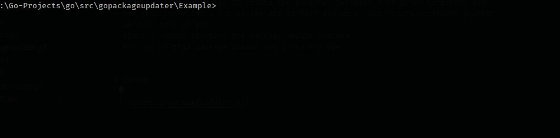

# gopackageupdater

- This repository is used to update the external packages from given directory path.
- New function accepts two parameters dirPath and mode. and return updatePKG pointer
- default mode is gin
- Start() method starting the package update process
- For use of this package please see given example

# Output

